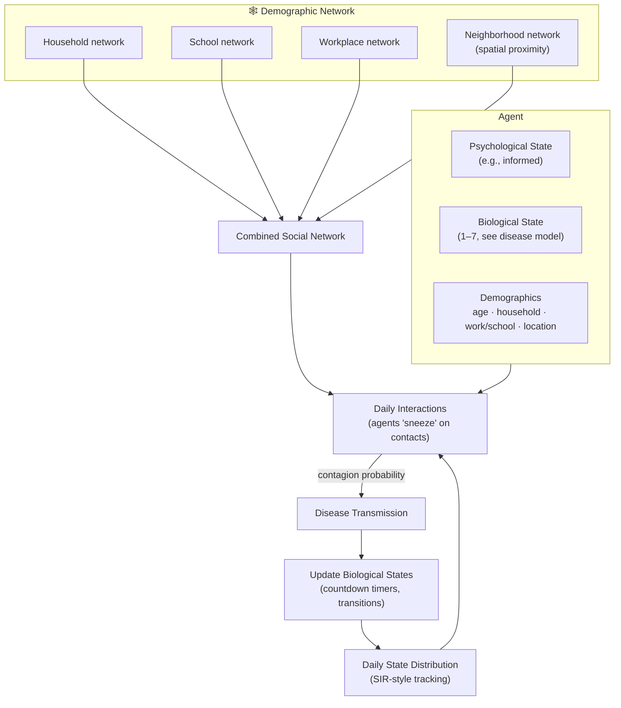
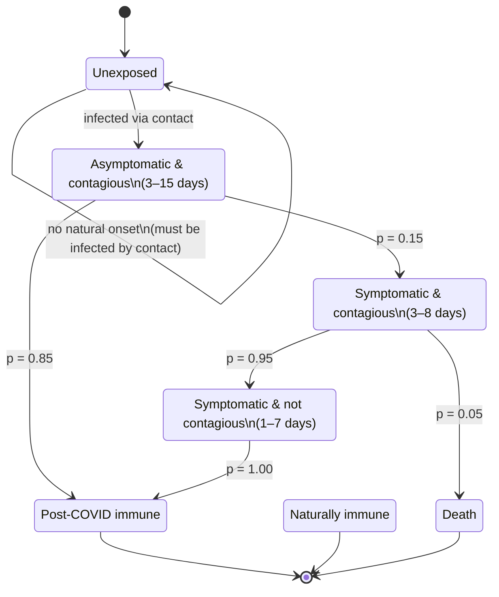
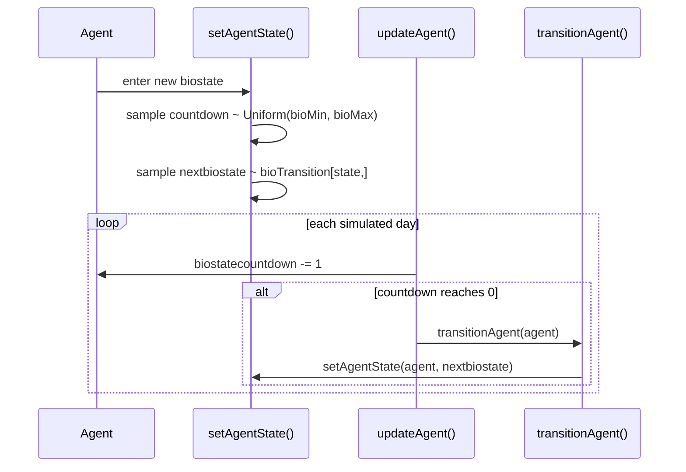
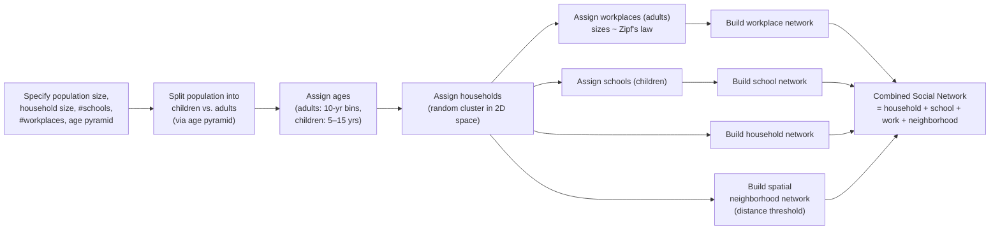
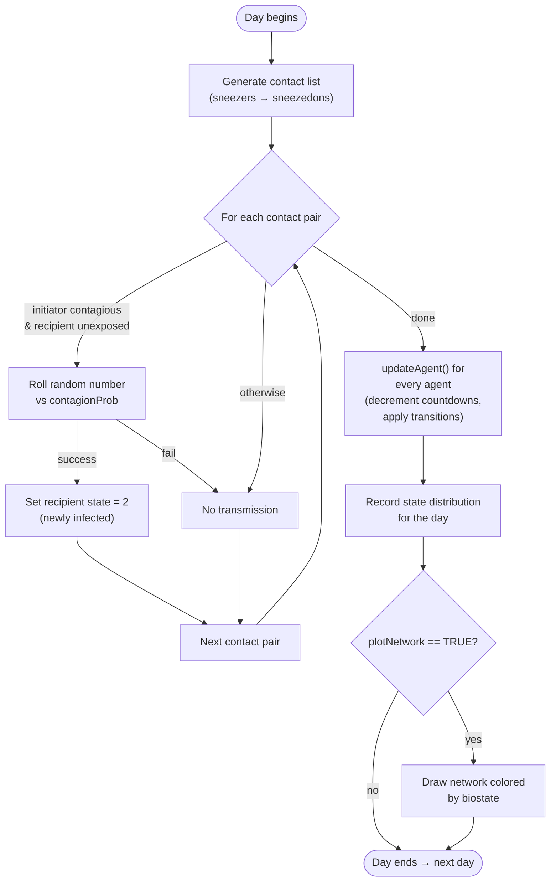
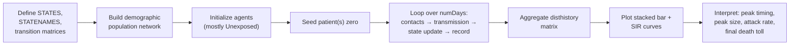

# Agent-Based Model of Epidemic Spread — Demographic Networks

**Mathematical Modeling and Simulation**

[](https://www.r-project.org/)
[](https://rmarkdown.rstudio.com/)
[]()
[]()

> An agent-based simulation that combines **disease progression (bio-state)**, **social network structure** (households, schools, workplaces, neighborhoods), and a simple contagion rule to study how epidemics move through a realistic, demographically-structured population.

---

## Attribution

> These codes are adapted from research work by **Lamia Alam & Shane Mueller** on *modeling psychological impacts on epidemic spread while accounting for demographic networks*. This repository is used for teaching purposes in STA 3040A (Mathematical Modeling & Simulation).

---

## Table of Contents

1. [Overview](#-overview)
2. [Conceptual Model](#-conceptual-model)
3. [Repository Contents](#-repository-contents)
4. [Requirements & Installation](#-requirements--installation)
5. [How the Model Works](#-how-the-model-works)
   - [5.1 The Agent](#51-the-agent)
   - [5.2 Biological State Machine](#52-biological-state-machine)
   - [5.3 Demographic / Social Network](#53-demographic--social-network)
   - [5.4 Simulation Loop](#54-simulation-loop)
6. [Key Functions Reference](#-key-functions-reference)
7. [Simulation Parameters](#-simulation-parameters)
8. [Running the Simulation](#-running-the-simulation)
9. [Outputs & Visualizations](#-outputs--visualizations)
10. [Example Workflow](#-example-workflow)
11. [Extending the Model](#-extending-the-model)
12. [Known Limitations](#-known-limitations)
13. [FAQ](#-faq)
14. [References](#-references)

---

## Overview

This project simulates an epidemic spreading through a synthetic population of **agents**. Each agent has:

- A **biological state** (health/disease status), which evolves through a stochastic, time-based state machine.
- A **psychological state** (currently simplified to a single "informed" state, with hooks for future extension into opinion dynamics — e.g., distancing behavior, conspiracy belief, quarantine compliance).
- A position in **four overlapping social networks**: household, school, workplace, and geographic neighborhood.

On each simulated day, agents interact with others drawn from their combined social network. If an infectious agent interacts with a susceptible agent, transmission occurs probabilistically. Each agent's disease then progresses automatically according to a pre-programmed transition schedule — much like a *task network model* with "ballistic" (pre-scheduled) events rather than being recomputed step-by-step.

The result is a rich, visual, and pedagogically transparent testbed for exploring:

- SIR/SEIR-like dynamics emerging from individual-level rules
- The effect of network structure (vs. random mixing) on spread
- Simple policy levers: quarantine (fewer interactions), reopening, natural immunity, contagion probability

---

## Conceptual Model



---

## Repository Contents

| File | Description |
|---|---|
| `1c_ABM_epidemic-demographics.Rmd` | Main R Markdown notebook: defines the agent, disease model, demographic network generator, and the full day-by-day simulation loop with visualizations. |

> Knitting the `.Rmd` produces an HTML (readthedown theme), Word document, or PDF report depending on the output format selected in the YAML header.

---

## Requirements & Installation

### R version
R ≥ 4.0 recommended.

### Required R packages

| Package | Purpose |
|---|---|
| `ggplot2` | Plotting state distributions and SIR curves |
| `dplyr` | Data wrangling |
| `sna` | Social network analysis, `gplot()` layout/plotting |
| `knitr` | Rendering the R Markdown document |
| `reshape2` | Reshaping wide state-history data to long format (`melt`) |
| `igraph` | Graph construction, preferential-attachment network generation (`sample_pa`), layouts |
| `rmarkdown` / `rmdformats` | Rendering to `readthedown` HTML theme |

Install everything with:

```r
install.packages(c(
  "ggplot2", "dplyr", "sna", "knitr",
  "reshape2", "igraph", "rmarkdown", "rmdformats"
))
```

Then knit the document in RStudio (`Knit` button) or from the console:

```r
rmarkdown::render("1c_ABM_epidemic-demographics.Rmd")
```

---

## How the Model Works

### 5.1 The Agent

Each agent is a simple R list created by `makeAgent()`:

```r
makeAgent(psychstate, biostate, age = 30)
# → list(psychstate, biostate, age, nextbiostate = NA, biostatecountdown = NA)
```

When placed into the demographic network, agents are further annotated with:

| Field | Meaning |
|---|---|
| `psychstate` | Psychological/behavioral state (currently fixed = 1, "informed") |
| `biostate` | Current biological/disease state (1–7) |
| `age` | Age in years, drawn from an age-pyramid distribution |
| `household` | ID of the household the agent belongs to |
| `work` | Workplace ID (0 if agent is a child / not employed) |
| `school` | School ID (0 if agent is an adult) |
| `head` | Boolean flag for "head of household" |
| `xy` | Spatial coordinates (inherited from household location, jittered) |
| `nextbiostate` | The state the agent will transition to next |
| `biostatecountdown` | Days remaining before that transition occurs |

### 5.2 Biological State Machine

The disease is modeled as **seven discrete states**:

| # | State | Description |
|---|---|---|
| 1 | Unexposed | Susceptible, never infected |
| 2 | Asymptomatic & contagious | Infected, no symptoms, can transmit |
| 3 | Symptomatic & contagious | Infected, symptomatic, can transmit |
| 4 | Symptomatic & not contagious | Symptomatic but past infectious window |
| 5 | Post-COVID immune | Recovered, presumed immune |
| 6 | Naturally immune | Never susceptible (pre-existing immunity) |
| 7 | Death | Deceased |

**Transitions** are governed by two matrices:

- `bioTransition[i, j]` — probability of moving from state *i* to state *j* once the countdown expires.
- `bioMin[i]` / `bioMax[i]` — the (uniformly sampled) minimum/maximum number of days spent in state *i* before transitioning.



**Transition probability table** (as coded):

| From → To | Probability | Duration in "From" state |
|---|---|---|
| Asymptomatic & contagious → Symptomatic & contagious | 0.15 | 3–15 days |
| Asymptomatic & contagious → Post-COVID immune | 0.85 | 3–15 days |
| Symptomatic & contagious → Symptomatic & not contagious | 0.95 | 3–8 days |
| Symptomatic & contagious → Death | 0.05 | 3–8 days |
| Symptomatic & not contagious → Post-COVID immune | 1.00 | 1–7 days |

The engine that drives this is a "ballistic" scheduling system (similar to a task-network model):



### 5.3 Demographic / Social Network

`makeDemographicNetwork()` builds a synthetic population with realistic structure:



**Network layers produced:**

| Network | Basis | Notes |
|---|---|---|
| `housenet` | Shared household ID | Dense, small cliques |
| `schoolnet` | Shared school assignment | Only connects children |
| `worknet` | Shared workplace assignment | Only connects adults; sizes follow a Zipf-like distribution |
| `neighborhood` | Spatial distance | Probabilistic — closer agents more likely connected |
| `network` (combined) | Sum of all above | Used to drive daily interactions |

Household locations are drawn uniformly in a 10×10 unit square; agents are placed near their household with small Gaussian jitter, so the neighborhood network reflects genuine spatial clustering.

### 5.4 Simulation Loop

Each simulated **day**:

1. **Contact generation** — every agent initiates `numInteractions` contacts, chosen either from their combined social network (weighted by tie strength) or, with some probability (`1 - sampleFromNetwork`), a uniformly random person from the whole population (representing chance encounters).
2. **Transmission check** — for every contact pair, if the initiator is in state 2 or 3 (contagious) and the recipient is in state 1 (unexposed), infection occurs with probability `contagionProb`.
3. **State update** — every agent's countdown decrements; agents whose countdown reaches zero transition to their pre-sampled next state.
4. **Bookkeeping** — the day's population-wide state distribution is recorded, and (optionally) the network is plotted with agents colored by current state.



---

## Key Functions Reference

| Function | Purpose |
|---|---|
| `makeAgent(psychstate, biostate, age=30)` | Constructs a single agent as a list |
| `setAgentState(agent, biostate)` | Assigns a new biostate and (re)samples its countdown & next-state |
| `transitionAgent(agent)` | Moves the agent to its pre-sampled `nextbiostate` |
| `updateAgent(agent)` | Advances one simulated day; triggers transition if countdown hits 0 |
| `makeNetwork(numAgents, numsets, steps, power)` | Generates a generic preferential-attachment network (used for early exploration/testing) |
| `makeDemographicNetwork(numAgents, householdsize, numSchools, numWorkplaces, agePyramid)` | Builds the full synthetic population with households, schools, workplaces, and spatial neighborhoods |
| `mygplot(coord, network, states, main, edgecol, add)` | Custom plotting function to render a network, colored by agent biostate, with a legend |

---

## Simulation Parameters

| Parameter | Default | Description |
|---|---|---|
| `numAgents` | 1000 | Population size |
| `numDays` | 100 | Simulation horizon (days) |
| `naturalImmunity` | 0 | Proportion of population starting in state 6 (naturally immune) |
| `numInteractions` | 8 / agent / day | Average daily contacts per agent |
| `contagionProb` | 0.03 | Probability of transmission per qualifying contact |
| `sampleFromNetwork` | 1.0 | Probability a contact is drawn from the agent's own network (vs. a random stranger) |
| `numInfected` (patient zero) | 5 | Number of agents seeded as initially infected (state 2) |
| `householdsize` | 2.5 | Average household size |
| `numSchools` | 4 | Number of distinct schools |
| `numWorkplaces` | 25 | Number of distinct workplaces |
| `agePyramid` | `c(20,8,10,12,14,13,12,11)` | Relative population weights across age bins (2 child bins + 6 adult decade bins) |

> **Policy experiments**: The commented-out lines
> `numInteractions[10:numDays] <- 3` (quarantine) and
> `numInteractions[25:numDays] <- 15` (reopening)
> show how to implement time-varying interventions by editing the `numInteractions` vector directly.

---

## Running the Simulation

```r
# 1. Load packages (see Requirements above)
# 2. Knit or source the .Rmd chunks in order:

# Build a demographic network
net <- makeDemographicNetwork(numAgents = 1000, numSchools = 4, numWorkplaces = 25)

# Initialize population & seed patient zero
pool <- lapply(1:1000, function(i) makeAgent(psychstate = 1, biostate = 1))
pool[[sample(1000, 1)]] <- setAgentState(pool[[sample(1000, 1)]], 2)

# Run the day-by-day loop (see full code in the .Rmd)
# ... produces disthistory matrix of daily state counts

# Visualize results
ggplot(histlong, aes(x = day, y = value, fill = variable)) +
  geom_bar(stat = "identity", position = "stack") + theme_bw()
```

For the full, runnable version (with contact generation, transmission, and per-day network plotting), see the final two code chunks of `1c_ABM_epidemic-demographics.Rmd`.

---

## Outputs & Visualizations

Knitting the document produces:

| Output | Description |
|---|---|
| **Static transition diagrams** | `gplot()` and `igraph` plots of the biological state transition network, with edge widths/labels showing transition probabilities |
| **Network layer plots** | Household, school, workplace, neighborhood, and combined-network visualizations, spatially laid out |
| **Animated network** (`fig.show='animate'`) | Per-day snapshots of the population, agents colored by current biostate — visually shows the epidemic wave moving through the social graph |
| **Stacked bar chart** | Daily population counts across all 7 biological states |
| **SIR-style line chart** | Aggregated Susceptible / Infected / Recovered curves over time |
| **State trajectory line chart** | Each of the 7 states plotted individually over the simulation horizon |

**Color legend used throughout network plots:**

| Color | State |
|---|---|
| ⚪ White | Unexposed |
| 🟡 Yellow | Asymptomatic & contagious |
| 🔴 Red | Symptomatic & contagious |
| 🟢 Green | Symptomatic & not contagious |
| 🟩 Dark green | Post-COVID immune |
| 🔵 Blue | Naturally immune |
| ⚫ Black | Death |

---

## Example Workflow



---

## Extending the Model

This codebase is intentionally modular so students can experiment:

- **Psychological/behavioral dynamics** — expand `psychstate` beyond the single "informed" value to include distancing, quarantine compliance, or belief in misinformation, and let it modulate `numInteractions` or `contagionProb` per-agent.
- **Age-structured risk** — currently `bioTransition` is uniform across ages; you could make death probability (state 3 → 7) a function of `agent$age`.
- **Vaccination / interventions** — add a new biostate or modify `naturalImmunity` dynamically over time.
- **Heterogeneous contagion** — vary `contagionProb` by network layer (e.g., higher within households than neighborhoods).
- **Reinfection** — currently "Post-COVID immune" is a terminal state; add a transition back to state 1 to model waning immunity.

---

## Known Limitations

- Psychological state is a stub (fixed at 1) — opinion dynamics are described conceptually but not yet implemented.
- All disease timing distributions are **uniform**, not empirically calibrated (e.g., gamma/log-normal, as commonly used in epidemiology).
- Transition probabilities are illustrative, not fit to real epidemiological data for any specific disease.
- The neighborhood network uses a simplified distance-threshold rule with a random cutoff per pair, which can be sensitive to population density.
- Performance: the nested loops (`for` over `sneezers`) are written for pedagogical clarity, not computational speed — large `numAgents` × `numDays` combinations may run slowly in base R.

---

## FAQ

**Q: Why do agents "sneeze" on each other via a random sampling loop instead of a vectorized operation?**
A: The code favors readability over performance since this is a teaching example — each step maps directly onto the conceptual model (who talks to whom, then does transmission occur).

**Q: Can I use a real contact network instead of the synthetic one?**
A: Yes — `socialnetwork` is just an adjacency matrix. Replace `net$network` with any weighted or binary adjacency matrix of the same dimension (`numAgents × numAgents`).

**Q: How do I model a lockdown?**
A: Reduce `numInteractions[day]` for the relevant day range (see the commented-out quarantine/reopening lines), and/or reduce `sampleFromNetwork` to simulate fewer stranger contacts.

**Q: What does `sampleFromNetwork` actually control?**
A: The probability that a given day's contact is drawn from the agent's own social network vs. a uniformly random member of the population — modeling the mix of routine (network) vs. incidental (random) contacts.

---

## References

- Alam, L. & Mueller, S. — original modeling framework for psychological impacts on epidemic spread accounting for demographic networks (attribution above).
- Preferential attachment network generation: `igraph::sample_pa()`.
- Social network analysis / plotting: `sna::gplot()`.

---

<p align="center"><i>Built for STA 3040A — Mathematical Modeling and Simulation</i></p>
